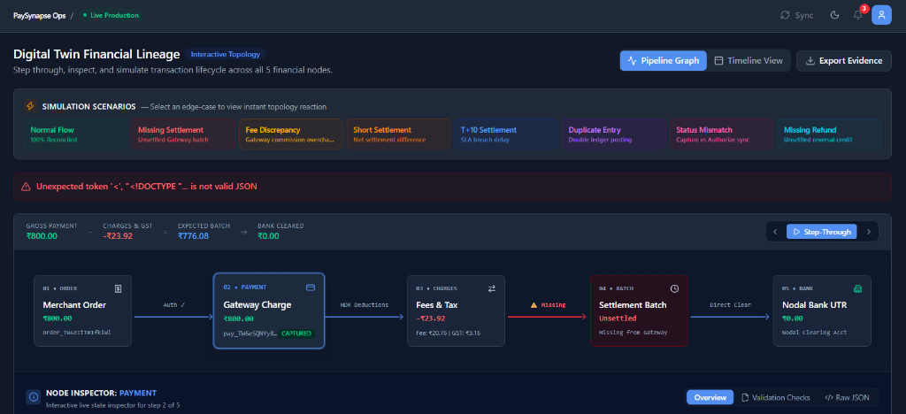

<div align="center">
  
  
  # PaySynapse
  
  **Autonomous Financial Reconciliation & Exception Intelligence Engine**

  [](https://nextjs.org/)
  [](https://reactjs.org/)
  [](https://tailwindcss.com/)
  [](https://www.prisma.io/)
  [](https://ai.google.dev/)
  [](LICENSE)

  *Catch missing settlements, gateway fee overcharges, short-settlements, and orphaned transactions instantly with 100% deterministic ledger matching and AI root-cause analysis.*

</div>

---

## Overview

**PaySynapse** is an enterprise-grade financial operations and reconciliation platform designed for high-volume payment processing. It bridges the gap between payment gateways (Razorpay, Stripe, Cashfree), internal merchant order ledgers, and bank clearing statements.

By replacing manual spreadsheet matching with a **deterministic 5-point reconciliation engine**, **visual digital-twin topology**, **traffic stress testing studio**, and **AI-powered dispute packet generation**, PaySynapse eliminates revenue leakage and provides complete transparency into financial operations.

---

## Key Features

### 1. 100% Deterministic 5-Point Reconciliation Engine
* **5-Point Lifecycle Matching**: Verifies arithmetic integrity from `01 Order` $\rightarrow$ `02 Payment` $\rightarrow$ `03 Charges & GST` $\rightarrow$ `04 Net Settlement` $\rightarrow$ `05 Bank Clearance (UTR)`.
* **Method-Aware MDR Pricing Matrix**: Dynamically resolves contractual fees by payment method (UPI: 0%, Debit Card: 0.9%, Credit Card: 1.8%, Netbanking: Flat ₹15, Wallets: 1.9%).
* **Instant Discrepancy Detection**: Flags missing settlements, MDR fee overcharges, short settlements, duplicate entries, SLA delays, and status mismatches.
* **Audit Compliant**: Strict double-entry ledger mathematics without speculative numbers.

### 2. Interactive Digital Twin Topology Visualizer

* **5-Stage Pipeline Graph**: Interactive step-by-step financial topology visualization with directional connectors and status pills.
* **Step-Through Playback Controller**: `▶ Step-Through` controller to walk through each node's funds flow step-by-step.
* **Arithmetic Balance Reconciliation Bar**: Live verification of Gross Amount $-$ Deductions (Fee + GST) $=$ Expected Batch.
* **1-Click Simulation Sandbox & History Reel**: Inject edge-cases (*Normal Flow, Missing Settlement, Fee Discrepancy, Short Settlement, T+10 Delay, Duplicate Entry, Status Mismatch, Missing Refund*) with an interactive history reel and 1-click **"↩ Back to Original Transaction"** navigation.
* **Tabbed Node Inspector**: Inspect Overview, Validation Checks, and Raw JSON payload for any node in the transaction chain.

### 3. Live Razorpay Test API & Cloudflare Tunneling Integration
* **Real-Time Webhook Ingestion**: Supports real live payments via Razorpay Test Mode with zero-delay webhook ingestion (`payment.captured`, `payment.failed`, `order.paid`).
* **Instant Public Tunneling**: Seamless local testing via Cloudflare Quick Tunnel (`npx cloudflared tunnel --url http://localhost:3000`).
* **Automated Exception Auditing**: Instantly detects Day $T+0$ in-flight funds (`MISSING_SETTLEMENT`) and gateway rate overcharges (`FEE_MISMATCH`).

### 4. Autonomous Dispute Packet Generator
* **One-Click Legal Notices**: Generates formal dispute notices citing official **RBI Master Directions** and **Section 10A of the IT Act 2000**.
* **Cryptographic Evidence Table**: Itemizes Gross Amount, Charged Fee, Net Variance, Gateway Payment ID, Order ID, and Bank UTR.
* **Export Options**: 1-click **Copy Email Notice** or **Print / Save as PDF** to send to payment aggregator legal/operations desks.

### 5. Cryptographic RBI Nodal Compliance Certificate Export
* **Verifiable Audit Proof**: Generates official RBI Escrow & Nodal Compliance Certificates directly from `/analytics`.
* **Cryptographic Merkle Root**: Includes verifiable SHA-256 Merkle root, official seal, and exact match rate statistics for regulators and auditors.

### 6. AI Copilot & Root Cause Analysis
* **Google Gemini AI Integration**: Autonomous investigation engine to diagnose anomalies and calculate net financial exposure.
* **Natural Language Copilot**: Ask natural language questions like *"What is our total risk exposure?"* or *"Analyze anomaly on payment pay_123"*.
* **Action Center Remediation**: Automated recommendations to resolve discrepancies directly from the UI.

### 7. Dynamic Pricing Matrix & Ledger Data Management
* **Configurable Fee Rules**: Manage contract rates on `/integrations` with an interactive settlement fee calculator.
* **Purge All Test Transactions**: One-click action on `/integrations` to clear all transactions and reset volume to `0` for live webhook testing.
* **Dynamic Re-Seed Volume Selector**: Choose between 50, 100, 250, 500, or 1,000 transaction datasets to re-populate and reconcile on demand.

### 8. Enterprise Razorpay-Inspired UI & Resizable Sidebar
* **Fintech Design System**: Clean typography with Inter font, `--rp-blue: #528FF0` primary branding, and crisp light/dark mode surfaces.
* **Resizable & Collapsible Sidebar**: Interactive drag-to-resize handle (68px to 380px) and one-click collapse toggle with localStorage persistence.
* **Real-Time Notification Bell**: Unread anomaly counter badge with interactive dropdown linking directly to exception triage.

---

## Documentation Suite

PaySynapse includes a comprehensive 9-module documentation index in [`docs/`](docs/00-documentation-index.md):

* **[00. Documentation Master Index](docs/00-documentation-index.md)**
* **[01. System Architecture & High-Level Design](docs/01-system-architecture.md)**
* **[02. Data Modeling & Database Schema (Prisma)](docs/02-data-modeling-and-database-schema.md)**
* **[03. Synthetic Data Generator & Edge-Case Architecture](docs/03-synthetic-data-generator.md)**
* **[04. Deterministic Reconciliation Engine & Dynamic Pricing](docs/04-reconciliation-engine.md)**
* **[05. Interactive Digital Twin & Topology Visualizer](docs/05-digital-twin-topology.md)**
* **[06. Exception Management, RBI Compliance & Dispute Notice](docs/06-exception-management-and-resolution.md)**
* **[07. AI Copilot, Root Cause Engine & Action Center](docs/07-ai-copilot-and-root-cause-analysis.md)**
* **[08. API Reference, Webhooks & CLI Tools](docs/08-api-reference-and-integration-guide.md)**
* **[09. Razorpay Test API Demo Guide (Live Tunnel Setup)](docs/09-razorpay-test-api-demo-guide.md)**
* **[Financial Terms, Reconciliation Logic & 3-Feed Ingestion Guide](docs/PaySynapse_Finance_Terms_and_Reconciliation.md)**

---

## Architecture & Tech Stack

```
PaySynapse Platform
├── Frontend: Next.js 16 (App Router), React 19, Tailwind CSS v4, Lucide Icons, Recharts
├── Backend: Next.js API Routes, Next Middleware, Webhook Handlers
├── Database & ORM: SQLite / PostgreSQL via Prisma ORM 5.22
├── AI Engine: Google Gemini AI SDK (@google/genai)
└── Auth & Security: JWT (jose), bcryptjs password hashing, HTTP-Only Cookies
```

---

## Getting Started

### Option A: 🐳 Docker Container Quickstart (Recommended)

Run the entire PaySynapse stack (Next.js 16 Web App + PostgreSQL 16 Database) in one command:

```bash
docker compose up --build
```

* PaySynapse Web Application will be available at [http://localhost:3000](http://localhost:3000).
* PostgreSQL will automatically initialize with persistent storage and seed demo datasets.

To stop the containers:
```bash
docker compose down
```

---

### Option B: Local Node.js Development

#### Prerequisites
* **Node.js**: v18.0.0 or higher
* **npm**: v9.0.0 or higher
* **PostgreSQL** or **SQLite**

#### Installation Steps

1. **Clone the repository**:
   ```bash
   git clone https://github.com/manu-1-1/PaySynapse.git
   cd PaySynapse
   ```

2. **Install dependencies**:
   ```bash
   npm install
   ```

3. **Set up Environment Variables**:
   Copy `.env.example` to `.env`:
   ```bash
   cp .env.example .env
   ```

4. **Initialize Database & Seed Data**:
   ```bash
   # Push Prisma schema
   npx prisma db push

   # Generate realistic demo dataset (Orders, Payments, Settlements, Exceptions)
   npm run generate-demo-data
   ```

5. **Start the Development Server**:
   ```bash
   npm run dev
   ```
   Open [http://localhost:3000](http://localhost:3000) in your browser.

---

## Account Login Credentials

Use the following credentials to sign in:

| Email | Password | Role |
| :--- | :--- | :--- |
| `ops@demo.paysynapse.com` | `password123` | Financial Operations Admin |

---

## Live Razorpay Demo & Webhooks

To test with real Razorpay Test Mode checkout:

```powershell
# 1. Start Cloudflare Tunnel in a separate terminal
npx cloudflared tunnel --url http://localhost:3000

# 2. Add your webhook in Razorpay Dashboard:
# URL: https://your-subdomain.trycloudflare.com/api/webhooks/razorpay
# Events: payment.captured, payment.failed, order.paid
```
For the full guide, read [**docs/09-razorpay-test-api-demo-guide.md**](docs/09-razorpay-test-api-demo-guide.md).

---

## License

This project is licensed under the MIT License - see the [LICENSE](LICENSE) file for details.

---

<div align="center">
  <sub>PaySynapse Platform — Autonomous Financial Operations</sub>
</div>
