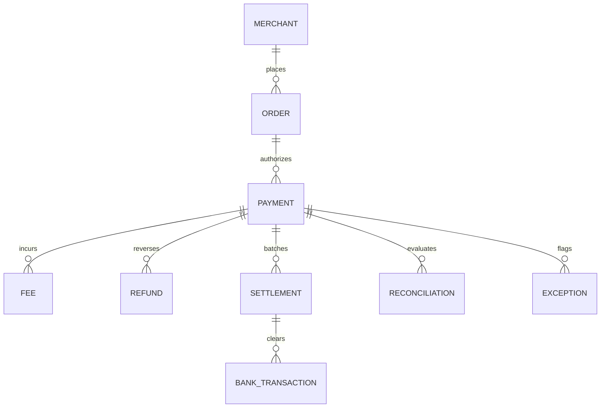

# Module 03: Database Schema & Data Models

## 3.1 Data Architecture Overview
PaySynapse uses Prisma ORM with PostgreSQL / SQLite. The database design mirrors a complete enterprise financial ledger, tracking the full lineage of money from consumer checkout to bank clearance.

---

## 3.2 Model Definitions & Schema Breakdown

### 1. `User` (Authentication & Access Control)
Stores administrative and operator accounts.
* `id` (`String`, `@id`, `@default(uuid())`): Unique user identifier.
* `email` (`String`, `@unique`): User login email.
* `passwordHash` (`String`): Salted bcrypt hash of password.
* `name` (`String`): Full name.
* `role` (`String`, default `"OPERATOR"`): User role (`ADMIN`, `OPERATOR`, `AUDITOR`).
* `createdAt` (`DateTime`, default `now()`): Account creation timestamp.

### 2. `Setting` (System Configuration)
Holds system-wide configuration keys (e.g. `GEMINI_API_KEY`, gateway parameters).
* `key` (`String`, `@id`): Unique configuration key.
* `value` (`String`): Plaintext or encrypted setting value.
* `updatedAt` (`DateTime`, `@updatedAt`): Last modification date.

### 3. `Merchant` (Tenant Entity)
Represents the business merchant operating the platform.
* `id` (`String`, `@id`, `@default(uuid())`): Merchant identifier.
* `name` (`String`): Business name.
* `createdAt` / `updatedAt` (`DateTime`).
* `orders` (`Order[]`): One-to-many relationship with orders.

### 4. `Order` (Internal Checkout Ledger)
Represents the merchant's internal purchase record before payment authorization.
* `id` (`String`, `@id`): Order ID.
* `externalOrderId` (`String?`, `@unique`): Order reference from merchant checkout (e.g. `ord_987654`).
* `merchantId` (`String`): Foreign key referencing `Merchant`.
* `amount` (`Decimal`): Total gross order value.
* `currency` (`String`, default `"INR"`): Currency code.
* `status` (`String`): Order state (`CREATED`, `PAID`, `FAILED`, `CANCELLED`).
* `createdAt` (`DateTime`).

### 5. `Payment` (Gateway Transaction)
Represents the payment gateway capture or failure event.
* `id` (`String`, `@id`): Payment ID.
* `externalPaymentId` (`String?`, `@unique`): Gateway ID (e.g., `rzp_pay_12345`).
* `orderId` (`String`): Foreign key referencing `Order`.
* `amount` (`Decimal`): Authorized payment amount.
* `currency` (`String`, default `"INR"`).
* `status` (`String`): Gateway status (`CAPTURED`, `FAILED`, `REFUNDED`).
* `method` (`String?`): Payment instrument (`UPI`, `CARD`, `NETBANKING`).
* `capturedAt` (`DateTime?`): Webhook capture timestamp.

### 6. `Fee` (Gateway Processing Charges)
Tracks MDR (Merchant Discount Rate) fees and GST assessed by the gateway.
* `id` (`String`, `@id`).
* `paymentId` (`String`): Foreign key referencing `Payment`.
* `amount` (`Decimal`): Gateway base fee.
* `tax` (`Decimal`): Goods & Services Tax (18% of fee amount).

### 7. `Refund` (Reversal Ledger)
Records refund issuances.
* `id` (`String`, `@id`).
* `externalRefundId` (`String?`, `@unique`): Gateway refund ID (e.g. `rfnd_001`).
* `paymentId` (`String`): Foreign key referencing `Payment`.
* `amount` (`Decimal`): Refund amount credited back to buyer.
* `status` (`String`): Refund state (`PROCESSED`, `PENDING`, `FAILED`).

### 8. `Settlement` (Gateway Payout Batch)
Represents the net funds payout batch transferred by gateway to nodal bank.
* `id` (`String`, `@id`).
* `externalSettlementId` (`String?`, `@unique`): Gateway batch ID (e.g. `set_batch_123`).
* `paymentId` (`String`): Foreign key referencing `Payment`.
* `amount` (`Decimal`): Net settlement amount calculated by gateway.
* `status` (`String`): Batch status (`SETTLED`, `PENDING`).
* `settledAt` (`DateTime?`): Payout timestamp.

### 9. `BankTransaction` (Bank Clearing Credit)
The final physical credit entry on bank nodal account statement.
* `id` (`String`, `@id`).
* `externalTransactionId` (`String?`, `@unique`): Bank UTR reference code.
* `settlementId` (`String?`): Foreign key referencing `Settlement`.
* `amount` (`Decimal`): Actual bank deposit amount.
* `transactionType` (`String`): `CREDIT` or `DEBIT`.
* `reference` (`String?`): UTR / NEFT / IMPS reference note.
* `transactionDate` (`DateTime`): Date credit hit bank statement.
* `status` (`String`): `CLEARED`, `PENDING`.

### 10. `Reconciliation` (Matching Record)
Stores the deterministic output of matching a payment lifecycle.
* `id` (`String`, `@id`).
* `paymentId` (`String`): Foreign key referencing `Payment`.
* `expectedAmount` (`Decimal`): Formulaic expected net settlement.
* `actualAmount` (`Decimal`): Actual recorded bank settlement.
* `difference` (`Decimal`): `expectedAmount - actualAmount`.
* `status` (`String`): `MATCHED` or `EXCEPTION`.
* `matchedAt` (`DateTime?`).

### 11. `Exception` (Discrepancy Triage Entity)
Stores operational financial exceptions requiring investigation.
* `id` (`String`, `@id`).
* `paymentId` (`String`): Foreign key referencing `Payment`.
* `type` (`String`): Exception category code.
* `severity` (`String`): `CRITICAL`, `HIGH`, `MEDIUM`, `LOW`.
* `financialImpact` (`Decimal`): Currency value at risk.
* `status` (`String`): `OPEN`, `INVESTIGATING`, `RESOLVED`, `OBSOLETE`.
* `description` (`String?`): Engine generated description.
* `aiExplanation` (`String?`): Gemini AI root-cause hypothesis.
* `aiConfidence` (`Float?`): Confidence level float (0.0 to 1.0).
* `recommendedAction` (`String?`): Suggested resolution step.
* `createdAt` / `resolvedAt` (`DateTime?`).

### 12. `WebhookEvent` (Raw Event Log)
Idempotency store for raw Razorpay / gateway webhook notifications.
* `id` / `eventId` (`String`, `@unique`): Unique gateway header ID.
* `event` (`String`): Event type (e.g. `payment.captured`).
* `payload` (`Json`): Raw webhook JSON body.
* `status` (`String`): `PENDING`, `PROCESSED`, `FAILED`.

### 13. `AuditLog` (Immutable Audit Trail)
Records every system action for compliance.
* `id` (`String`, `@id`).
* `entityId` / `entityType` (`String?`): Affected entity ID & type.
* `action` (`String`): Action code (e.g., `RECONCILIATION_EXECUTED`, `EXCEPTION_RESOLVED`).
* `details` (`Json?`): Contextual payload.
* `userId` (`String?`): Operator user ID.
* `createdAt` (`DateTime`).

---

## 3.3 Relationship Diagram (Mermaid)

